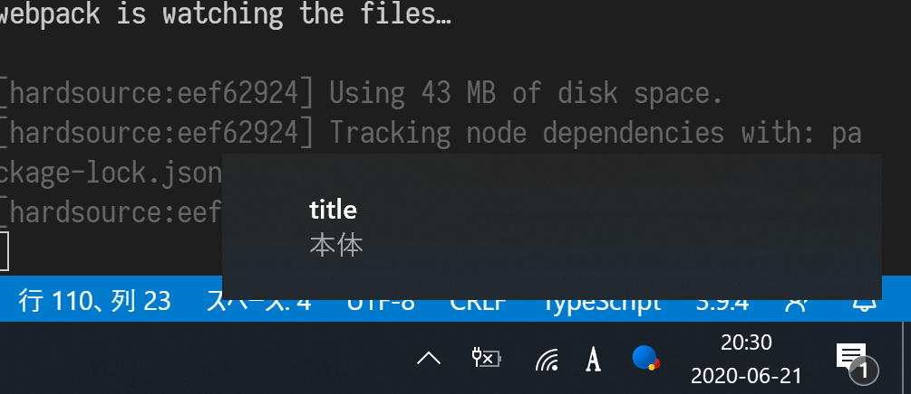
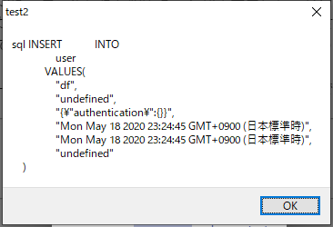
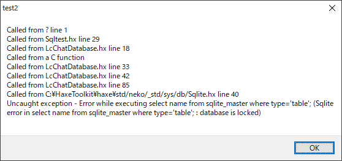
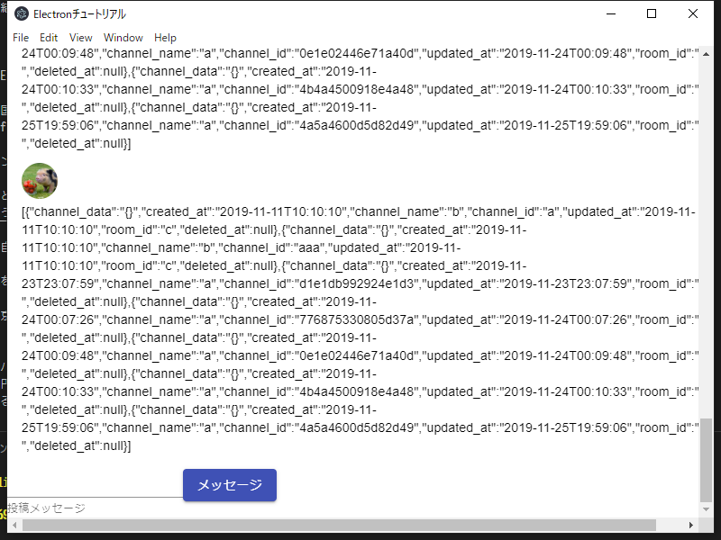
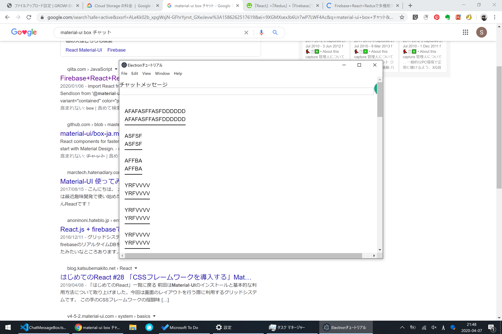
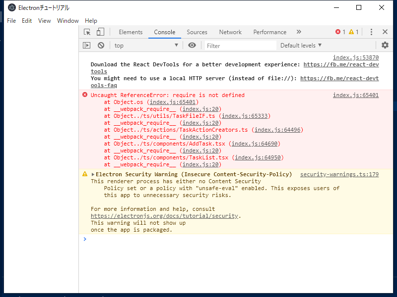
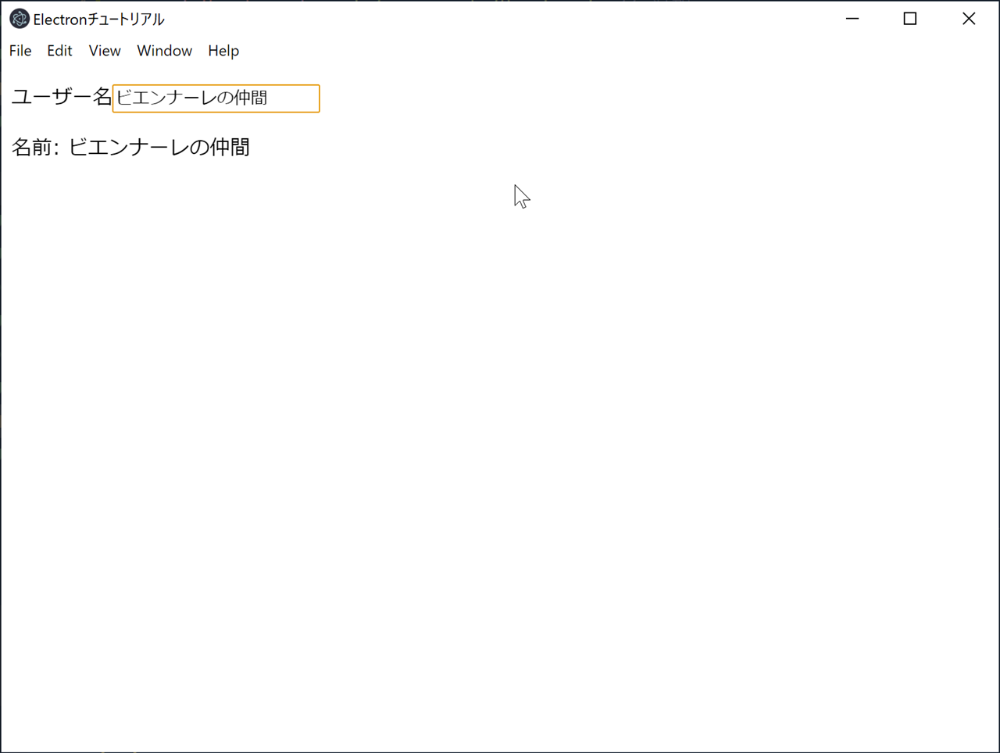

# TypeScriptでElectron

<!-- @import "[TOC]" {cmd="toc" depthFrom=2 depthTo=3 orderedList=true} -->

<!-- code_chunk_output -->

1. [Link](#link)
    1. [GitHub](#github)
2. [todo](#todo)
3. [記録](#記録)
    1. [20200820 通知アイコン変化](#20200820-通知アイコン変化)
    2. [20200817 Action実行後に次のAction実行](#20200817-action実行後に次のaction実行)
    3. [20200814 ファイル保存ダイアログ](#20200814-ファイル保存ダイアログ)
    4. [20200805](#20200805)
    5. [20200803](#20200803)
    6. [20200802](#20200802)
    7. [20200716](#20200716)
    8. [20200717](#20200717)
    9. [20200712](#20200712)
    10. [20200711](#20200711)
    11. [20200708](#20200708)
    12. [20200706](#20200706)
    13. [20200705](#20200705)
    14. [20200702](#20200702)
    15. [20200630](#20200630)
    16. [20200628](#20200628)
    17. [20200623 通知とか](#20200623-通知とか)
    18. [20200621 通知](#20200621-通知)
    19. [20200618 タリーズ滑川](#20200618-タリーズ滑川)
    20. [20200617 exe化](#20200617-exe化)
    21. [20200613 滑川図書館にて](#20200613-滑川図書館にて)
    22. [20200531](#20200531)
    23. [20200519](#20200519)
    24. [20200528 memo](#20200528-memo)
    25. [20200527](#20200527)
    26. [20200523](#20200523)
    27. [20200521](#20200521)
    28. [20200520](#20200520)
    29. [20200519](#20200519-1)
    30. [20200518 初回ログイン](#20200518-初回ログイン)
    31. [20200516 初回ログイン](#20200516-初回ログイン)
    32. [20200514](#20200514)
    33. [20200513](#20200513)
    34. [20200510](#20200510)
    35. [20200510](#20200510-1)
    36. [20200509 Electronのパッケージ化](#20200509-electronのパッケージ化)
    37. [20200506](#20200506)
    38. [20200505 DBアクセス](#20200505-dbアクセス)
    39. [20200426 SQL](#20200426-sql)
    40. [20200424 コマンド実行](#20200424-コマンド実行)
    41. [20200422 SQLite2](#20200422-sqlite2)
    42. [20200421 SQLite](#20200421-sqlite)
    43. [20200408](#20200408)
    44. [20200407](#20200407)
    45. [20200406](#20200406)
    46. [20200403](#20200403)
    47. [20200401](#20200401)
    48. [20200330](#20200330)
    49. [20200108](#20200108)
    50. [20191202](#20191202)
    51. [20191202](#20191202-1)
    52. [20191201-2](#20191201-2)
    53. [20191201](#20191201)
    54. [20191130](#20191130)
    55. [20191129](#20191129)
    56. [20191127 4日目～7日目](#20191127-4日目~7日目)
    57. [20191125 3日目](#20191125-3日目)
    58. [20191105](#20191105)

<!-- /code_chunk_output -->

## Link
### GitHub
https://github.com/s-densan/lcchat-gui
## todo
Trelloで管理
https://trello.com/b/Dmnn4KKp
## 記録

### 20200820 通知アイコン変化
新着があると通知アイコンを赤くする。

### 20200817 Action実行後に次のAction実行
https://teratail.com/questions/130390
https://qiita.com/muiyama/items/63386fd65c7e9f06f5d4
https://github.com/redux-saga/redux-saga/blob/master/README_ja.md
### 20200814 ファイル保存ダイアログ
https://www.google.com/search?q=electron+%E3%83%95%E3%82%A1%E3%82%A4%E3%83%AB%E4%BF%9D%E5%AD%98%E3%83%80%E3%82%A4%E3%82%A2%E3%83%AD%E3%82%B0&oq=electron+%E3%83%95%E3%82%A1%E3%82%A4%E3%83%AB%E4%BF%9D%E5%AD%98%E3%83%80%E3%82%A4%E3%82%A2%E3%83%AD%E3%82%B0&aqs=chrome..69i57j69i61.14495j0j4&sourceid=chrome&ie=UTF-8
公式 : https://www.electronjs.org/docs/api/dialog
### 20200805
Reactでドラッグアンドドロップに対応する。

- [React]ドラッグ&ドロップのファイルアップロードを簡単実装！「react-dropzone」の紹介
https://www.aizulab.com/blog/react-dropzone/


Electronでローカルファイル画像を表示する

- ローカルファイルシステムからのElectron JS画像
https://www.it-swarm.dev/ja/electron/%e3%83%ad%e3%83%bc%e3%82%ab%e3%83%ab%e3%83%95%e3%82%a1%e3%82%a4%e3%83%ab%e3%82%b7%e3%82%b9%e3%83%86%e3%83%a0%e3%81%8b%e3%82%89%e3%81%aeelectron-js%e7%94%bb%e5%83%8f/838519275/
### 20200803
jestについて
https://typescript-jp.gitbook.io/deep-dive/intro-1/jest
### 20200802
nimのユニットテストについて。
https://qiita.com/honeytrap15/items/3bb0dcd63e12983ab975
ついでにnimbleを使って管理してみる。

typescriptのユニットテストについて。
https://qiita.com/karak/items/9d0ebf7bc50085624913
テストツールが複数あるらしく、どうもjestを推している人が多いみたい。
```
yarn add jest ts-jest @types/jest
```

### 20200716
Rustを試したけどうーーーんということで、
nimに手を出してみようかな（だからなぜマイナーなのに手を出す。。。）
#### nim言語でSQLiteを扱ってみる

https://nnahito.com/articles/33
```nim
import db_sqlite
import os,times


proc dbTest(dbFilePath : string, sqlFilePath: string) = 
  var f : File = open(sqlFilePath, FileMode.fmRead)
  defer:
    close(f)
    echo "closed"
  let query = f.readAll()
  let db = open(dbFilePath, "", "", "")
  db.exec(sql(query))
  echo "テーブル作ったヨン"


let sqlPath = "../sql/create_table/create_room.sql"
let sqlDirPath = "../sql/create_table"
# let sqlPath = "create_room.sql"
let dbPath = "aaa.db"

for kind, path in os.walkDir(sqlDirPath):
  if path.splitFile[2] == ".sql":
    echo(path)
    dbTest(dbPath, path)
```
かんたんに作れます。すげー。
### 20200717
nimたん、代数的データ型行けてるじゃないですか。
書きづらいけど。
ちゃんとコンパイル時にチェックしてくれます。
```nim
type
  FooEnum = enum
    Stringer, Numberer
  Foo = object
    case kind: FooEnum
    of Stringer:
      x: string
    of Numberer:
      x1: int
      y: int


let
  a = Foo(kind: Stringer, x: "hi")
  b = Foo(kind: Stringer, x: "hello")
  c = Foo(kind: Numberer, x1:444, y: 333)
proc FooTest(t: Foo) = 
  case t.kind:
  of Stringer:
    echo t.x
    # echo t.y # error
  of Numberer:
    echo t.y
    echo t.x1
    # echo t.x # error
    echo "num"
  echo t
FooTest(a)
FooTest(b)
FooTest(c)
```
### 20200712
Rustで作るという案。
#### 競技プログラミングにおけるPythonとRustの対応関係まとめ - Qiita
https://qiita.com/wotsushi/items/4a6797f52080453a0440
比較が非常にわかりやすい。

### 20200711
Haxe cppだとSQLiteコマンドに日本語(英語以外?)が含まれる場合にエラーとなるようで、困った。
なんだろこの縛り。。。
nekoも一緒に配布していいかな。。。

### 20200708
exeパック時のパス見つからない問題を解決。
app.getAppPathを起点にすればだいたい解決するみたい。頑張って見直した。
これで仮リリースできるかな。
これは些細だけど、ノートPCでHaxe cppのコンパイルできない。なんで？

### 20200706
メインプロセスでConfigファイルを読み込んで、レンダラプロセスで参照したい。

#### ElectronのBrowserWindow間で直接メッセージをやりとりする

https://taku-o.hatenablog.jp/entry/20181013/1539424953
global/getGlobalを使う。

ただし、typescriptだとglobalに型がついていて、追加できない。
declareで無理やりanyにする。
#### taku-o / hello-electron-003-to-sub-msg

https://github.com/taku-o/hello-electron-003-to-sub-msg/blob/master/electron.ts
#### アンビエント宣言(declare)と型定義ファイル(d.ts)

型をあとから強制する
https://www.wakuwakubank.com/posts/501-typescript-declaration/
### 20200705
electronプログラムのアプリディレクトリの取得
https://qiita.com/ikasumi_wt/items/6cda005500f1d3dc6b2d
### 20200702
electron-packagerのignoreオプションが余計なファイルを巻き込みすぎるのを何とかした

https://taku-o.hatenablog.jp/entry/20171204/1512415038

不要ファイルを無視する方法
```sh
electron-packager . MYukkuriVoice --platform=darwin --arch=x64 --electronVersion=1.7.9 --icon=icns/myukkurivoice.icns \
  --overwrite --asar.unpackDir=vendor \
  --ignore="^/\.gitignore" \
  --ignore="^/\.gitmodules" \
  --ignore="^/bin" \
  --ignore="^/docs" \
  --ignore="^/icns" \
  --ignore="^/test" \
  --ignore="^/README.md" \
  --ignore="^/vendor/aqk2k_mac" \
  --ignore="^/vendor/aqtk1-mac" \
  --ignore="^/vendor/aqtk2-mac" \
  --ignore="^/vendor/aqtk10-mac"
```
### 20200630 
GitHubで実行ファイル（ソースコードを含まない）をZIPファイルで配布してみる
https://qiita.com/keita69sawada/items/da6d8f6b6fb8f05ca670

### 20200628 

おかしなところがあるものの、とりあえず完成。
配布方法というか、GitHubでの管理方法を調べる。
まずはbitbucketから引っ越ししよう。
#### ElectronのMenuのカスタマイズ
https://qiita.com/ferretdayo/items/bcbbf8246cdfa8d2ee2a
メニューの作り方
#### HTMLでテキストを下寄せに配置する方法を現役エンジニアが解説【初心者向け】
https://techacademy.jp/magazine/29525
下寄せCSS

- 親要素positionにrelativeを指定する
- 子要素positionにabsolute
- 子要素bottomに0

```tsx
<div style={{ width: '97%', height:'100%', position: 'relative' }} >
    <List dense style={{
        width: '100%',
        verticalAlign: 'left',
        bottom: 0,
        position: 'absolute'
    }} >
        {chatMessageListElems}
    </List>
</div>
```

### 20200623 通知とか
#### tsxのコメント
tsxでコメントを書く場合は{}をつけてtsのコメントを書く。
```tsx
{/*
  ここはコメント
*/}
```
#### Momentで24時間制
``hh``ではなく``HH``
```ts
const postedAt = Moment(props.postedAt).format('YYYY-MM-DD HH:mm');
```
#### 通知クリックでshow,focus
通知オブジェクトのon関数呼び出し
第一引数は``click``
#### 実行パス取得
アイコン画像のパスを指定するのに必要。
``__dirname``を使っていたが、これだとjsファイルの場所になってしまう。
なのでカレントディレクトリを取得するために``process.cwd()``とする。

```
process.argv[1] から、node コマンドに指定された a.js のパス( ~/hoge/Foo.js/a.js )を取得できます

process.cwd() から、node コマンド実行時のワーキングディレクトリパス( ~/hoge/Foo.js )を取得できます

__dirname には、現在実行中のソースコードが格納されているディレクトリパスが格納されています。

~/hoge/Foo.js/a.js 内部で __dirname を取得すると ~/hoge/Foo.js になります
~/hoge/Foo.js/b/b.js 内部で __dirname を取得すると ~/hoge/Foo.js/b になります
~/hoge/Foo.js/c/c.js 内部で __dirname を取得すると ~/hoge/Foo.js/c になります
ソースコード(a.js, b.js, c.js)を結合し、1ファイル化(a.js)した場合は、 __dirname の値が変化します
require("path").resolve("") で cwd を基準とした絶対パスを求める事ができます

```
https://gist.github.com/uupaa/da42698d6b2d2cbb3cca
#### アイコン画像

ここのを拝借。
https://icooon-mono.com/15528-%e4%bc%9a%e8%a9%b1%e3%82%a2%e3%82%a4%e3%82%b3%e3%83%b3/
[](https://icooon-mono.com/i/icon_15528/icon_155281_64.png)
### 20200621 通知
@ドトール豊田文苑堂
通知させようとしたところ以下のエラー。
レンダラーからはremoteでNotificationオブジェクトにアクセスする必要があるっぽい。
``Electron: Notification is not a constructor``

https://stackoverflow.com/questions/51028866/electron-notification-is-not-a-constructor
```
I think you should write

new electron.remote.Notification({....})
instead of

new electron.Notification({....})
```
ノートPCの不調か、アクションセンターが起動しない事もあったけど、
再起動したら通知された。


### 20200618 タリーズ滑川
electron exe化

サイズを小さくする方法
https://tsuwatch.hatenablog.com/entry/2017/05/29/130829
resourceフォルダ以下はこれだけで良いようで。
```
.\RESOURCES\APP
│  index.html
│  package.json
│
├─dist
│      index.js
│      main.js
│
└─img
        test.ico
```
### 20200617 exe化
electron-packagerでexe化を目指す。
その他の依存ファイルをコピーするため、バッチにしよう。
あと、どうもアドミンじゃないと設定の一部が反映されない？
```
$ D:\IdeaProjects\lcchat-gui\node_modules\.bin\electron-packager . lcchat-gui --platform=darwin,win32 --arch=x64
Packaging app for platform win32 x64 using electron v7.3.1
Cannot create symlinks (on Windows hosts, it requires admin privileges); skipping darwin platform
```
### 20200613 滑川図書館にて
Trelloボード作成。 
https://trello.com/b/Dmnn4KKp/lcchat
メインプロセスとレンダラプロセスでデータを共有したい。
https://qiita.com/sprout2000/items/5253a8dee40197359949


```
Cannot read property 'readFileSync' of undefined
```
意味不。メインプロセスがうまいことライブラリの解決？ターゲットの設定？ができていないみたい。
https://www.subarunari.com/entry/electronWebpackConfig
→うまくいった。

タスクトレイ常駐
https://taku-o.hatenablog.jp/entry/2019/02/05/224111
### 20200531 
サボりすぎー
Todo追加
- チャット　ウィンドウ表示位置
- リアクションのカスタマイズ テキストリアクションとか
- ドラッグ・アンド・ドロップで添付する機能をチャットに追加
### 20200519 
### 20200528 memo
これからReactを勉強する人が最初に見るべきスライド７選 | UX MILK
https://uxmilk.jp/43555
### 20200527
メモ。
Electronでホットリロード開発をしたい！

https://qiita.com/ganariya/items/982803466e22dc53eaeb
```
cmd /c yarn add electron-reload
```
で、組み込んでみたけど、これjsを編集しないとリロードされないんか。いまいち使えない。
消しとく。
```
cmd /c yarn remove electron-reload
```
### 20200523
画面のリサイズイベント補足。
electronのイベントを使用。
https://qiita.com/seltzer/items/258d579b50d3a99e5bb7
### 20200521
クロックタイマー実装。
参考：
https://blog.ikappio.com/drawing-with-setinterval-on-react/
### 20200520
ユーザ関係がいい感じになってきた。
次は定期的に新着メッセージを確認する仕組みを作る。
多分一番の山場。

- まずはボタンを押すと新着メッセージのみ追加する仕組み
- その後、更新メッセージの変更
- 同様に削除も
- さらに定期的に自動同期する仕組み。

### 20200519
ログインチェック後、失敗したならばログイン画面を出したい。
アクションの後続としてアクションを実行する方法は？
https://teratail.com/questions/130390
wakaran
### 20200518 初回ログイン

→エラー。
理解不能理解不能理解不能
``userData = ""``にすると通る。再び理解不能理解不能理解不能
### 20200516 初回ログイン
#### react-reduxでページ読み込み時、actionを呼び出す方法

https://qiita.com/gaku3601/items/062a52748acc5e368453
componentDidMountを使う方法
だけど最近はHookを使うほうが良いかと。

https://ja.reactjs.org/docs/hooks-effect.html
でもuseEffect内でdispatchしても反応しない？


https://qiita.com/keiya01/items/fc5c725fed1ec53c24c5
```js
    useEffect(
        () => {
            const time = setInterval(() => {
                dispatch({ type: "ADD_COUNT" });
            }, state.tick);

            return () => clearInterval(time);
        },
        [ state.tick ]
    );
```
こんな感じ

### 20200514 
#### Electronタスクトレイ
- Electronでタスクトレイ常駐のアプリを作る
  https://officeforest.org/wp/2019/05/15/electron%E3%81%A7%E3%82%BF%E3%82%B9%E3%82%AF%E3%83%88%E3%83%AC%E3%82%A4%E5%B8%B8%E9%A7%90%E3%81%AE%E3%82%A2%E3%83%97%E3%83%AA%E3%82%92%E4%BD%9C%E3%82%8B/
- Electronでデスクトップウィジェットを作るまで
  https://qiita.com/SallyAcolyte/items/94ed26ab62b8b32b1b2c

``main.js``に書かなきゃならない？ので注意。
#### Electron ホットキー

globalShortcutを使う。
これも``main.js``に書く。
tsにできないのかしら。

- Electronで、ショートカットキー（globalShortcut）
  https://programmer-jobs.blogspot.com/2016/06/electron-globalshortcut.html

- Electronでデスクトップウィジェットを作るまで
  https://qiita.com/SallyAcolyte/items/94ed26ab62b8b32b1b2c
  画面活性化について

### 20200513 


tsのbuild時に以下のようなメッセージが大量に表示された。
```
[hardsource:815366b5] Could not freeze (webpack)/buildin/module.js: Cannot read property 'hash' of undefined
```
https://teratail.com/questions/235183
ここより、node_modules/.cacheを削除してみると良いとのことで実施。
```
ERROR in ./node_modules/@sgarciac/bombadil/node_modules/moment/moment.js
Module build failed: Error: ENOENT: no such file or directory, open 'D:\IdeaProjects\lcchat-gui\node_modules\@sgarciac\bombadil\node_modules\moment\moment.js'
 @ ./node_modules/@sgarciac/bombadil/lib/tools.js 3:13-30
 @ ./node_modules/@sgarciac/bombadil/lib/parser.js
 @ ./node_modules/@sgarciac/bombadil/lib/tables.js
 @ ./ts/utils/AppConfig.ts
 @ ./ts/reducers/ChatMessageReducer.ts
 @ ./ts/Store.ts
 @ ./ts/index.tsx
```
なんか違うエラーが出た。``yarn upgrade``してみる。

なんだかんだやってたらうまくいった。

#### 状態管理のわかりやすいのがあった。
https://www.jacepark.com/how-to-use-redux-easily-with-redux-toolkit-in-react-native/
### 20200510 
#### Reduxが辛いのでredus toolkitというのを導入してみる。
https://redux-toolkit.js.org/introduction/quick-start
#### Redux Toolkit で Redux の煩わしさから解放される

https://qiita.com/__sakito__/items/e446d0f0974f2e12a5f5

#### HookとRedux ToolkitでReact Reduxに入門する

https://www.hypertextcandy.com/learn-react-redux-with-hooks-and-redux-starter-kit
#### Redux Toolkit で React.js の状態管理をもっと簡単にする方法[TypeScript版]

https://www.webopixel.net/javascript/1601.html
### 20200510 
いっぱい投稿したら出るエラー。
対策したはずなんだけど。


### 20200509 Electronのパッケージ化
exeにする。

- Electronの手習い〜Electron環境からパッケージ化まで〜
https://qiita.com/tagosaku324/items/c720499080d523bbe1d7

```
yarn add electron-packager
yarn run electron-packager . sample --platform=win32 --arch=ia32
```
SQLインターフェイス用のhaxeプログラムについて、リトライ機能をつけた。
### 20200506
#### 一番下までスクロールする
https://dev.classmethod.jp/articles/react-scroll-into-view-on-load/
https://codepen.io/meltedice/pen/QWjLaad?editors=1111
#### 横に並べたり右端にアイコンを固定したり。
https://material-ui.com/components/lists/#interactive
### 20200505 DBアクセス
DBから読み込み、書き込み機能実装。
JSONからの読み込みで戸惑う。
Reduxの複雑さ、同じようなコードをたくさん書かなきゃいけない煩雑さが嫌になってきた。
乗り換えよっかな。

DB情報を読み込むタイミングを検討。
とりあえず10秒毎にでもしときゃいいのかな。

今日参考にしたサイトメモ
#### 忘れやすい、複雑なJSONの要素をfor...in文で取り出す方法

https://www.weed.nagoya/entry/2016/05/11/105145
### 20200426 SQL
HaxeのSQL実行機能と連携して、SQL打てるようにした。

### 20200424 コマンド実行
sqliteは諦めて外部プログラムを呼び出せるよう、コマンド実行方法を調査。
```ts
    child_process.exec('dir', (error, stdout, stderr) => {
        if (error) {
            // エラー時は標準エラー出力を表示して終了
            alert(stderr);
            return;
        } else {
            // 成功時は標準出力を表示して終了
            alert(stdout);
        }
    })
```
### 20200422 SQLite2
【俺メモ】CentOS7にNode.js＋SQLite3環境をインストール

https://qiita.com/nullpointer_t/items/792c35d068d37ed8ce2a

んー？？
いかが必要かも。
https://github.com/mapbox/node-pre-gyp
```
Add node-pre-gyp to dependencies
Add aws-sdk as a devDependency
Add a custom install script
Declare a binary object

```

謎のエラーが出るのです。
これ、Windowsだとだめなやつかな？

→シンプルなプロジェクトだと動く。
```js
var sqlite3 = require('sqlite3').verbose();
var db = new sqlite3.Database('D:\\IdeaProjects\\sqlitetest\\test.db');
 
db.serialize(function() {
  db.run("CREATE TABLE lorem (info TEXT)");
 
  var stmt = db.prepare("INSERT INTO lorem VALUES (?)");
  for (var i = 0; i < 10; i++) {
      stmt.run("Ipsum " + i);
  }
  stmt.finalize();
 
  db.each("SELECT rowid AS id, info FROM lorem", function(err, row) {
      console.log(row.id + ": " + row.info);
  });
});
 
db.close();
```

typescriptだと以下。
```ts

import {Database} from 'sqlite3';
var db = new Database('D:\\IdeaProjects\\sqlitetest\\test.db');
 
db.serialize(function() {
  db.run("CREATE TABLE lorem (info TEXT)");
 
  var stmt = db.prepare("INSERT INTO lorem VALUES (?)");
  for (var i = 0; i < 10; i++) {
      stmt.run("Ipsum " + i);
  }
  stmt.finalize();
 
  db.each("SELECT rowid AS id, info FROM lorem", function(err, row) {
      console.log(row.id + ": " + row.info);
  });
});
 
db.close();
```

ヒント
https://github.com/LedgerHQ/ledgerjs/issues/278
https://github.com/mapbox/node-sqlite3/issues/909


### 20200421 SQLite
#### Node.js で SQLite を扱う


https://neos21.hatenablog.com/entry/2018/04/22/080000

``yarn``で``sqlite3``と``@types/sqlite3``を導入。

### 20200408
```
Uncaught Error: Invalid hook call. Hooks can only be called inside of the body of ...
```
わからんのじゃ！
うーん、material-uiのサイトを参考にしてたが、うまく行かない。
https://material-ui.com/components/lists/#simple-list
→Hookというものを使っていて、それがクラス式のコンポーネントの記載方法に対応していないらしい。
→``ChatMessagePostBox``を書き直してみたよ！なれない。
#### Invalid Hook Call Warning

https://ja.reactjs.org/warnings/invalid-hook-call-warning.html
なんか、クラスの中でフック（useから始まるなにか）を使っちゃいけないんだって。え、どうしろと？
#### フックに関するよくある質問
https://ja.reactjs.org/docs/hooks-faq.html#what-can-i-do-with-hooks-that-i-couldnt-with-classes
わかった。フックはクラスじゃ使えないわ。
もっというと、クラスで作る設計を置き換える新しい作り方っぽい。えーそうなん？なんでやろ。
#### React Hooksとは？各Hooksの使い方やルールを紹介

https://microcms.io/blog/what-is-react-hooks/
わかりやすい開設。うむ、流れはクラスから関数でコンポーネントを実現するのか。
あんま直感的じゃないけど、副作用を極力排除するならそうなるのか。

#### React+Reduxで書く時に気をつけていること/悩み3：hooks便利すぎ問題
https://www.fundely.co.jp/blog/tech/2019/11/20/180045/#section4
ここもわかりやすい。Hook有無比較がいい。
### 20200407
デザインをいじり始めて沼。
#### 『React』 +『Redux』 + 『Firebase』でLINE風のChat機能を作ろう！ 【Component編】

https://qiita.com/micropig3402/items/3431c998df582a441fa5

お、悪くない。色々いじっていけそう。
### 20200406
#### Material-UI で Menu を作るときは anchorEl を忘れるな！

https://qiita.com/nacky00/items/d5a2a55735210bfc9c57
### 20200403
https://qiita.com/EBIHARA_kenji/items/1a043794014dc2f3a7db
> store と component を連結させる
> 一通りのものが揃いましたが、まだ react と redux の連結ができていません。component でその設定をします。
> 
> すべてのコンポーネントで連携する必要はありません。先に述べた、container となるコンポーネントを redux と連携します。

この設定がわかんなかった。Stateのトップレベルのコンポーネントと、Store(その中のState)を紐付ける。
そして下位のコンポーネントはPropsで伝搬させる。なるほどー。やっとわかってきた。
React+Redux、わっかりづらいなあー

### 20200401
ReduxとかFluxがよくわからん。手持ちの本はFlux、参考にしたサイトはRedux。
並列に並べていいものかもよくわからん。調査！
https://qiita.com/syossan27/items/7e1b2e07ac68b96bdaa7
どうも、FluxはReduxから派生したものらしい。
### 20200330
なぜかnueに浮気をしつつ。

でもwebpackあたりでしくってる。
どうしくったかよくわからない。
https://qiita.com/kenboo/items/996daf12a3eb17b7c89f
### 20200108
改めて、開発再開です。
デザインが絶望的なので、なんかいい感じのサンプルとか解説とかを漁る。
https://hisa-web.net/archives/382
ちが

https://qiita.com/junara/items/b8251bcb75760467aca4
スタイル適用方法。いいね。
https://cieloazul310.github.io/2019/06/typescript-material-ui-v4/
typescript
### 20191202
webpackのビルドを10倍高速化するプラグインの紹介
https://qiita.com/kmdsbng/items/d23f9b5f5fbc8869baad

### 20191202
Electron+React.jsで作るチャットアプリ

http://jesus9387.hatenablog.com/entry/2017/10/24/182438
### 20191201-2
どうも``import OS from 'os'``が悪さをしているように見える。なんでやねん。
と思ったけど、やっぱfs-extraも悪さしているみたい。みんな悪い子。
なにか設定が足りんのかしら。



→きたー！！これか、requireが働いていなかったのか。クソかよ。
Electron + Node.js 使用時の “Uncaught ReferenceError: require is not defined” への対処
https://qiita.com/okadato623/items/f8b7573ad911ca97ba49

``main.js``の``createWindow``を以下のように変える。
Before
```js
function createWindow() {
    // ブラウザウィンドウの作成
    win = new BrowserWindow({
        width: 800,
        height: 600
    })
    // index.html をロードする
    win.loadFile('index.html')
    // 起動オプションに、 "--debug"があれば開発者ツールを起動する
    if (process.argv.find((arg) => arg === '--debug')) {
        win.webContents.openDevTools()
    }
    // ブラウザウィンドウを閉じたときのイベントハンドラ
    win.on('closed', () => {
        // 閉じたウィンドウオブジェクトにはアクセスできない
        win = null
    })
}
```
After
```js
function createWindow() {
    // ブラウザウィンドウの作成
    win = new BrowserWindow({
        width: 800,
        height: 600,
        webPreferences: {
            nodeIntegration: true
        }
 
    })
    // index.html をロードする
    win.loadFile('index.html')
    // 起動オプションに、 "--debug"があれば開発者ツールを起動する
    if (process.argv.find((arg) => arg === '--debug')) {
        win.webContents.openDevTools()
    }
    // ブラウザウィンドウを閉じたときのイベントハンドラ
    win.on('closed', () => {
        // 閉じたウィンドウオブジェクトにはアクセスできない
        win = null
    })
}
```
### 20191201
TypeScript の async/await を Electron で使ってみる
https://aquasoftware.net/blog/?p=694

Electron+typescriptでasyncが使えない件だが、ここのサンプルはちゃんと動くのです。不思議。
Reactだとだめなんかな。
→なんか動かんくなった。もうわからんよ。複雑すぎる。

で、モジュールインポートの方式が今まで見てきたTypeScriptのソースと異なるのだが、なんでだろう？
モジュール側1
```ts
export const waitAsync = async function waitAsync(n: number): Promise<number> {
    var startTime = Date.now();
    var timeInterval = await new Promise<number>((resolve) => setTimeout(() => resolve(Date.now() - startTime), n));
    tryLog(`waited ${timeInterval}ms (@${process.type})`);
    return timeInterval;
}
```
モジュール側2
```ts
module.exports.waitAsync = async function waitAsync(n: number): Promise<number> {
    var startTime = Date.now();
    var timeInterval = await new Promise<number>((resolve) => setTimeout(() => resolve(Date.now() - startTime), n));
    tryLog(`waited ${timeInterval}ms (@${process.type})`);
    return timeInterval;
}
```
インポート側1
```ts
import {waitAsync, process} from './asyncTest';
```
インポート側2
```ts
var asyncClient = require('./asyncTest');
```

### 20191130 
いろんなやり方で環境構築。
https://qiita.com/maecho/items/c34de805101ae489532e
#### 関東最速
https://qiita.com/IzumiSy/items/b7d8a96eacd2cd8ad510
```
npx create-react-app ts-react-app --typescript
npm install --save redux react-redux
npm install -D @types/react-redux
npm install --save typescript-fsa typescript-fsa-reducers
```
いいかんじ。
次はelectron対応。
なんかようわからんけど、いずれにしてもElectronを入れるにはbabelとかいう謎のものを入れる必要がありそう。
```
npm i babel-core babel-loader babel-preset-env -D
```
### 20191129 
さっぱりわからん。真っ白画面になる。どうもasyncとかawaitとかのあたりがだめっぽい。それかファイル保存しているところか。
やってみたこと
```
yarn add async
yarn add await
yarn add @types/async
yarn add typescript-async
yarn add promise
yarn add @types/promise
```
### 20191127 4日目～7日目
一気に。中身は詳しくわからんけど、なんか雰囲気はつかめてきた。

- [4日目](https://qiita.com/EBIHARA_kenji/items/80adee2214d439209f98)
- [5日目](https://qiita.com/EBIHARA_kenji/items/6da1cebb65a18279d096)
- [6日目](https://qiita.com/EBIHARA_kenji/items/26fa0d004cbaeea807e4)
- [7日目](https://qiita.com/EBIHARA_kenji/items/19b13207b7a8055043c4)

インストールしたもの。
```
yarn add moment @types/moment
yarn add styled-components @types/styled-components
yarn add reset-css
yarn add style-loader css-loader
yarn add react-datepicker@1.7.0 @types/react-datepicker@1.1.7
yarn add fs-extra @types/fs-extra
```
### 20191125 3日目
いいかげんGUIも作っていこうかと。
https://qiita.com/EBIHARA_kenji/items/25e59f7132b96cb886f3
前回は2日目まで終わっていたので、[3日目](https://qiita.com/EBIHARA_kenji/items/1a043794014dc2f3a7db)をすすめる。
途中でインストールが必要だったのでメモ。
```
yarn add uuid
yarn add @types/uuid
yarn add clone
yarn add @types/clone
```
実行コマンド
```
yarn build
yarn start
```

おお、手順通りにするだけでそれっぽい画面がでけたで！素敵！

``yarn watch``を使えるように、``package.json``をいじる。
```json
{
  "name": "test2",
  "version": "1.0.0",
  "description": "",
  "main": "main.js",
  "scripts": {
    "test": "echo \"Error: no test specified\" && exit 1",
    "build": "webpack",
    "start": "electron ./",
    "watch": "webpack --watch"
  },
  "author": "",
  "license": "ISC",
  "dependencies": {
    "@types/clone": "^0.1.30",
    "@types/uuid": "^3.4.6",
    "clone": "^2.1.2",
    "react": "^16.11.0",
    "react-dom": "^16.11.0",
    "react-redux": "^7.1.1",
    "redux": "^4.0.4",
    "styled-components": "^4.4.1",
    "uuid": "^3.3.3"
  },
  "devDependencies": {
    "@types/react": "^16.9.11",
    "@types/react-dom": "^16.9.3",
    "@types/react-redux": "^7.1.5",
    "@types/redux": "^3.6.0",
    "electron": "^7.0.1",
    "ts-loader": "^6.2.1",
    "tslint": "^4.5.1",
    "tslint-loader": "^3.5.4",
    "typescript": "^3.6.4",
    "webpack": "^4.41.2",
    "webpack-cli": "^3.3.10"
  }
}
```

### 20191105
#### TypeScriptでElectron始め
ここ見ながらセットアップ。ただし、npmの代わりにyarnを使ってみる。
https://qiita.com/necomeshi/items/1861ff80e689a377899a

```
yarn add typescript
yarn add electron
yarn add webpack
yarn add webpack-cli
yarn add ts-loader
```

package.jsonの設定。
こちらを参照。
https://qiita.com/toricor_/items/6ef7f53c4e11aa5167e9
```json
{
  "dependencies": {
    "electron": "^7.0.1",
    "ts-loader": "^6.2.1",
    "typescript": "^3.6.4",
    "webpack": "^4.41.2",
    "webpack-cli": "^3.3.10"
  },
  "scripts": {
    "test": "echo \"Error: no test specified\" && exit 1",
    "build": "tsc",
    "watch": "tsc -w",
    "tsc": "tsc",
    "init": "tsc --init"
  }
}
```
んーつまった。webpackってなんやねん。

こっちので挑戦。
https://qiita.com/EBIHARA_kenji/items/25e59f7132b96cb886f3

```
npm install --save react react-dom redux react-redux styled-components
npm install --save-dev electron typescript tslint webpack webpack-cli ts-loader tslint-loader
npm install --save-dev @types/react @types/react-dom @types/redux @types/react-redux
```

コンパイルでエラー。
```
./node_modules/.bin/webpack
Hash: 578cb98298d788bb0bef
Version: webpack 4.41.2
Time: 710ms
ERROR in ./ts/index.tsx
Module build failed (from ./node_modules/tslint-loader/index.js):
Error: Tslint should be of version 4+
    at Object.module.exports (C:\Users\shimp\OneDrive\Documents\pkb\main\doc\プロジェクト\その他\20190421_電算倶楽部システム管理\制作
物\test2\node_modules\tslint-loader\index.js:136:11)  
```
tslintのバージョンを指定してインストール。
```
npm install --save-dev  tslint@^4.0.0
```
んー、ちがう。

``npm install --save-dev @types/react @types/react-dom @types/redux @types/react-redux``をし忘れていたみたい。


おお、ちゃんと画面がでたべ！！


#### 一方
https://qiita.com/seibe/items/769e932b21544b075688
https://lib.haxe.org/t/electron/
```
haxelib install electron
```

新規のプロジェクトフォルダを作成し、メインソースである``Main.hx``を作成。
チュートリアル通り
```haxe
class Main {
  static public function main():Void {
    trace("Hello World");
  }
}
```
これはできたが…
electronインストールわからん。

うーんわからん。あきらめた。
